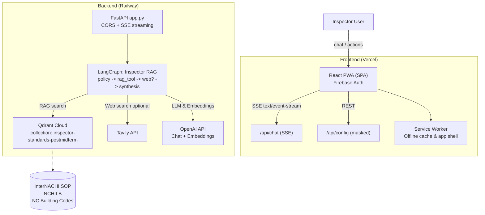
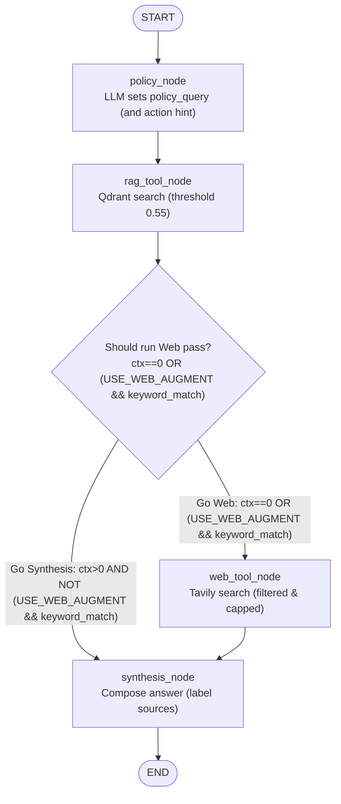

# House Whisperer – System Architecture

This document describes the current architecture that is already implemented. We will evolve and extend this as new capabilities land (e.g., report generation flow).

## High-level diagram

## Components

- Frontend (Vercel)
  - React SPA (Create React App) with a mobile-first PWA shell
  - `ChatbotWidget` streams responses via SSE from `POST /api/chat`
  - Firebase Authentication (Google) gates inspector UI
  - Service Worker (`public/sw.js`) pre-caches app shell and provides offline navigation fallback
  - SPA rewrites via `frontend/vercel.json`

- Backend (Railway)
  - FastAPI (`api/app.py`) with CORS; streams SSE chunks for chat responses
  - LangGraph workflow (`api/langgraph_inspector_rag.py`) implements agentic RAG
    - Nodes: `policy` → `rag_tool` → conditional `web_tool` → `synthesis` → `END`
    - One-pass web augmentation triggered by keywords when enabled
    - Retrieval via Qdrant; synthesis via OpenAI
    - Inspector RAG runs a fast single-pass path. Keyword-based web augmentation is optional via `USE_WEB_AUGMENT`.
  - Web search tools (`api/web_search_tools.py`) powered by Tavily, with detailed filtering logs
  - Config endpoint `GET /api/config` returns masked, effective configuration values

- Data & Services
  - Qdrant Cloud vector DB (collection `inspector-standards-postmidterm`)
  - Tavily API for real-time web search
  - OpenAI API for embeddings and chat completions
  - Firebase Auth for sign-in on the frontend

## Chat flow (Inspector RAG)

1. PWA sends `POST /api/chat` with the user’s message
2. Backend streams progress events over SSE:
   - startup → research → web (optional) → synthesis → complete
3. LangGraph pipeline:
   - `policy` proposes a `policy_query`
   - `rag_tool` queries Qdrant (score threshold 0.55, diversified sources)
   - `web_tool` runs once when RAG is empty or when keyword-augmented (configurable)
   - `synthesis` composes the final answer, clearly labeling regulatory vs web-derived content
4. Frontend renders the streamed chunks, normalizes markdown, and displays sources

## PWA details

- Manifest + icons for installability
- Service Worker provides:
  - App-shell precache
  - Cache-first for hashed assets under `/static/`
  - Navigation fallback to `/index.html` for offline SPA routing

## Configuration & environment

Environment variables (local: `api/.env`; deployed via Railway/Vercel):
- Core
  - `OPENAI_API_KEY` (masked in logs and `/api/config`)
  - `QDRANT_URL`, `QDRANT_API_KEY`
  - `TAVILY_API_KEY`
- Web augmentation knobs
  - `USE_WEB_AUGMENT` (0/1)
  - `WEB_AUGMENT_KEYWORDS` (comma-separated)
  - `WEB_TOOL_FETCH_LIMIT`, `WEB_AUGMENT_MAX`
  - `WEB_MIN_SCORE_GENERIC`, `WEB_MIN_SCORE_RECALL`
- CORS / Misc
  - `ALLOWED_ORIGINS`, `VERCEL_URL`, `PORT`

You can view the effective, masked runtime config at `GET /api/config`.

## Observability

- SSE progress messages clearly mark each phase
- Web search filtering logs:
  - Raw/kept counts, below-threshold filters, duplicate removals, and caps
- `/api/test-rag` provides quick sanity probes for env, OpenAI/Qdrant connectivity, and a sample search

## Deployment

- Frontend (Vercel): root set to `frontend/`, SPA rewrites configured
- Backend (Railway): `api/` service, `PORT` provided by platform; CORS includes deployed frontend

## Planned additions (next)

- Report generation flow using a call-model policy loop (plan → rag per section → write → consolidate → finalize)
- Buyer-facing RAG (post Demo Day) over finalized reports
- Expanded metrics endpoint and structured logs for traces

---

Last updated: keep this file current as we evolve the system.

## Inspector RAG LangGraph (current)

Notes:
- Keyword augmentation path depends on `USE_WEB_AUGMENT=1` and `WEB_AUGMENT_KEYWORDS` match; then a single web pass runs even if RAG has context.
- Web results are filtered by score and de-duplicated, then capped by `WEB_TOOL_FETCH_LIMIT`/`WEB_AUGMENT_MAX` before synthesis.
