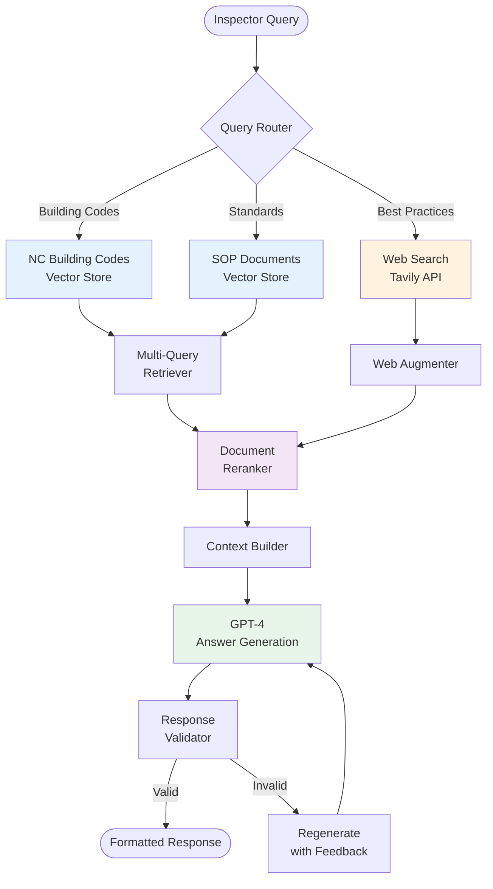

# Inspector RAG Architecture

## Overview
The Inspector RAG (Retrieval-Augmented Generation) system provides real-time access to building codes, standards, and best practices. It serves as the authoritative knowledge base for code compliance and technical standards.

## Architecture Diagram



## Core Components

### 1. Query Processing Pipeline

#### Query Router
- **Purpose**: Intelligent routing based on query intent
- **Classification**:
  ```python
  query_types = {
      "building_code": ["code", "requirement", "section", "chapter"],
      "standards": ["NACHI", "SOP", "procedure", "standard"],
      "best_practices": ["how to", "best way", "recommended"],
      "recall": ["recall", "manufacturer", "cpsc", "safety"]
  }
  ```

#### Multi-Query Generation
- **Strategy**: Generate multiple query variations
- **Example**:
  ```
  Original: "insulation requirements for attics"
  Generated:
  - "attic insulation R-value requirements"
  - "thermal insulation code attic space"
  - "minimum insulation thickness residential attic"
  ```

### 2. Knowledge Sources

#### NC Building Codes (Primary)
- **Content**: 2024 North Carolina Building Code Collection
- **Format**: Vectorized PDF sections
- **Index Size**: ~50,000 chunks
- **Embedding Model**: OpenAI text-embedding-3-small
- **Vector Store**: Qdrant Cloud

#### SOP Documents (Secondary)
- **Content**: 
  - InterNACHI Standards of Practice
  - NC Home Inspector Licensure Board Guidelines
- **Format**: Structured inspection procedures
- **Index Size**: ~10,000 chunks

#### Web Augmentation (Tertiary)
- **Provider**: Tavily API
- **Use Cases**:
  - Product recalls
  - Manufacturer updates
  - Current best practices
  - Recent code amendments
- **Configuration**:
  ```python
  WEB_AUGMENT_KEYWORDS = [
      "recall", "manufacturer", "cpsc", 
      "best practices", "2024", "update"
  ]
  WEB_MIN_SCORE_GENERIC = 0.4
  WEB_AUGMENT_MAX = 5
  ```

### 3. Retrieval Strategy

#### Vector Search
```python
def retrieve_documents(query: str, top_k: int = 10):
    # 1. Embed query
    embedding = openai.embed(query)
    
    # 2. Search multiple collections
    results = []
    results.extend(qdrant.search("nc_codes", embedding, top_k))
    results.extend(qdrant.search("sop_docs", embedding, top_k))
    
    # 3. Apply similarity threshold
    filtered = [r for r in results if r.score > 0.7]
    
    return filtered
```

#### Reranking Pipeline
```python
def rerank_documents(query: str, documents: List[Dict]):
    # 1. Cross-encoder reranking
    reranked = cross_encoder.rerank(query, documents)
    
    # 2. Metadata boosting
    for doc in reranked:
        if "chapter" in doc.metadata:
            doc.score *= 1.2  # Boost official chapters
        if doc.metadata.get("year") == "2024":
            doc.score *= 1.1  # Boost current year
    
    # 3. Diversity filtering
    return ensure_diversity(reranked, max_similar=3)
```

### 4. Answer Generation

#### Context Assembly
```python
def build_context(documents: List[Dict], web_results: List[Dict]):
    context = {
        "building_codes": [],
        "standards": [],
        "web_augment": [],
        "metadata": {}
    }
    
    # Categorize sources
    for doc in documents:
        if doc.source == "nc_codes":
            context["building_codes"].append(doc)
        elif doc.source == "sop":
            context["standards"].append(doc)
    
    # Add web results if relevant
    context["web_augment"] = web_results[:WEB_AUGMENT_MAX]
    
    return context
```

#### LLM Prompting
```python
INSPECTOR_PROMPT = """
You are an expert home inspector assistant with deep knowledge of:
- 2024 North Carolina Building Codes
- InterNACHI Standards of Practice
- NCHILB regulations
- Current safety recalls and manufacturer bulletins

Given the following context, provide a comprehensive answer:

Building Codes:
{building_codes}

Standards:
{standards}

Current Information:
{web_results}

Query: {query}

Requirements:
1. Cite specific code sections when applicable
2. Prioritize safety and compliance
3. Provide practical inspection guidance
4. Note any recent updates or recalls
5. Be concise but thorough

Response:
"""
```

### 5. Response Validation

#### Quality Checks
```python
def validate_response(response: str, query: str) -> bool:
    checks = {
        "has_answer": len(response) > 50,
        "addresses_query": query_similarity(query, response) > 0.6,
        "has_citations": bool(re.search(r'Section \d+', response)),
        "no_hallucination": verify_claims(response),
        "appropriate_length": 100 < len(response) < 2000
    }
    
    return all(checks.values())
```

## Data Flow

### Query Lifecycle
```
1. User Query → "What is the minimum R-value for attic insulation?"
2. Query Analysis → {type: "building_code", keywords: ["R-value", "attic", "insulation"]}
3. Multi-Query → ["R-value attic", "insulation requirements", "thermal resistance"]
4. Vector Search → Retrieve top 10 chunks from each source
5. Reranking → Reorder by relevance, boost official codes
6. Web Augment → Check for recent updates or recalls
7. Context Build → Assemble structured context
8. LLM Generation → Generate comprehensive answer
9. Validation → Verify quality and accuracy
10. Response → Return formatted answer with citations
```

## Integration with Report Writer

### Conditional RAG Triggering
```python
def should_use_rag(section: str, narrative: str, rerank_score: float) -> bool:
    # Always use RAG for code-heavy sections
    code_sections = ["electrical", "structural", "plumbing", "hvac"]
    if section.lower() in code_sections:
        return True
    
    # Use RAG if code keywords detected
    code_keywords = ["recall", "manufacturer", "code", "requirement", "standard"]
    if any(keyword in narrative.lower() for keyword in code_keywords):
        return True
    
    # Use RAG if narrative quality is low
    if rerank_score < 0.7:
        return True
    
    return False
```

### RAG Response Format
```python
{
    "response": "Comprehensive answer with citations...",
    "sources": [
        {
            "type": "building_code",
            "reference": "Section 1102.2.1",
            "content": "Ceiling insulation R-value..."
        }
    ],
    "confidence": 0.92,
    "web_augmented": false
}
```

## Performance Optimization

### Caching Strategy
- **Query Cache**: LRU cache for repeated queries (15 min TTL)
- **Embedding Cache**: Cached embeddings for common terms
- **Document Cache**: Frequently accessed code sections

### Batch Processing
```python
async def batch_query_rag(queries: List[str]):
    # Process multiple queries in parallel
    tasks = [query_inspector_rag(q) for q in queries]
    results = await asyncio.gather(*tasks)
    return results
```

### Response Time Targets
- **P50**: < 2 seconds
- **P95**: < 5 seconds
- **P99**: < 10 seconds

## Configuration

### Environment Variables
```bash
# Vector Database
QDRANT_URL=https://qdrant.cloud.io
QDRANT_API_KEY=<key>
QDRANT_COLLECTION=nc_codes_v1

# Web Augmentation
TAVILY_API_KEY=<key>
USE_WEB_AUGMENT=1
WEB_TOOL_FETCH_LIMIT=8
WEB_AUGMENT_MAX=5
WEB_MIN_SCORE_GENERIC=0.4

# LLM Configuration
OPENAI_API_KEY=<key>
MODEL_NAME=gpt-4-turbo-preview
MAX_TOKENS=2000
TEMPERATURE=0.3
```

## Error Handling

### Fallback Strategy
1. **Primary**: Vector search + reranking
2. **Secondary**: Keyword search in cached documents
3. **Tertiary**: Web search only
4. **Final**: Generic response with disclaimer

### Error Recovery
```python
async def query_with_fallback(query: str):
    try:
        # Primary: Full RAG pipeline
        return await full_rag_pipeline(query)
    except VectorDBError:
        # Fallback: Cached documents
        return await search_cached_docs(query)
    except Exception as e:
        # Final: Web search only
        return await web_search_only(query)
```

## Monitoring & Analytics

### Key Metrics
- Query volume and types
- Response times by source
- Cache hit rates
- Reranking effectiveness
- Web augmentation usage
- Error rates by component

### Query Analytics
```python
{
    "total_queries": 10000,
    "avg_response_time": 2.3,
    "source_distribution": {
        "building_codes": 0.45,
        "standards": 0.30,
        "web_augment": 0.15,
        "cached": 0.10
    },
    "top_query_types": [
        "electrical_code": 0.25,
        "insulation": 0.20,
        "plumbing": 0.15
    ]
}
```

## Security & Compliance

### Access Control
- API key authentication
- Rate limiting per client
- Query sanitization
- Response filtering for PII

### Data Privacy
- No storage of personal information
- Query logs anonymized
- Compliance with data regulations

## Future Enhancements

### Planned Features
1. **Multi-State Support**: Expand beyond NC codes
2. **Visual Search**: Support for diagram/image queries
3. **Voice Interface**: Audio query and response
4. **Predictive Caching**: Pre-load likely queries
5. **Custom Inspector Profiles**: Personalized knowledge bases

### Research Areas
- Fine-tuned models for code interpretation
- Graph-based knowledge representation
- Real-time code update ingestion
- Automated compliance checking