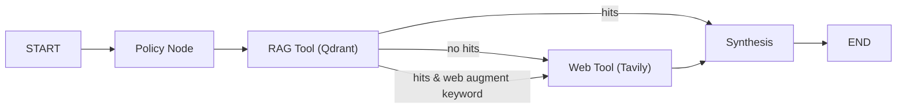

# Inspector RAG Architecture (v2.2 – Current Branch)

A concise, presentation-ready view of the RAG graph actually running in this branch. Optimized for clarity and speed when explaining to stakeholders.

## Executive Diagram (Copy/Paste)

## Talk Track (60 seconds)
- We run a lightweight, 4-node LangGraph pipeline for inspection standards Q&A.
- Every question goes through a policy node, then straight to RAG (Qdrant vector search) first.
- If RAG has no results — or the query looks like a recall/manufacturer question — we do one web pass (Tavily).
- We synthesize a professional answer with GPT-4o-mini, prioritizing regulatory sources and optionally blending web findings.
- This keeps responses fast (typically ~2–3s with RAG only; ~4–5s with web augmentation) and predictable.

## Node Roles
- Policy Node: Sets the immediate plan (rag → optional web → synth). Simple logic routing for predictability.
- RAG Tool (Qdrant):
  - Embedding model: text-embedding-3-small
  - Collection: `inspector-standards-postmidterm`
  - Top-k: 6 (score_threshold ≈ 0.55)
  - Source diversity: group by `source`, max 3 per source, then take top 5 overall
- Web Tool (Tavily):
  - Triggered when RAG has no hits or when query contains recall/manufacturer keywords
  - Returns up to 5 filtered resources (score cutoff differs for recall vs generic)
- Synthesis (GPT-4o-mini):
  - Builds a structured context (REGULATORY SOURCES then WEB RESOURCES) and writes the final answer
  - Clear instructions: prioritize standards for requirements; web for best practices/current info

## Control Flow Details
- Always: START → Policy → RAG
- After RAG:
  - No hits → Web → Synthesis → END
  - Hits + keyword match (USE_WEB_AUGMENT) → Web → Synthesis → END
  - Hits + no keyword match → Synthesis → END
- One synthesis pass; no multi-turn agent loops.

## Configuration (key env)
- OPENAI_API_KEY, QDRANT_URL, QDRANT_API_KEY
- EMBEDDING_MODEL=text-embedding-3-small, CHAT_MODEL=gpt-4o-mini
- USE_WEB_AUGMENT=0/1; WEB_AUGMENT_KEYWORDS (recall, manufacturer, cpsc, best practices, how to, current, update, 2024)
- WEB_TOOL_FETCH_LIMIT (default 8), WEB_AUGMENT_MAX (default 5)

## Why This Is Fast
- Single embedding + single Qdrant search (top-k 6)
- Optional, single web augmentation pass
- One synthesis call (deterministic, temperature ~0.1)
- Simple, acyclic graph with minimal branching

## Differences vs “Reranked RAG” Design
- No Cohere reranking here (raw vector similarity + source diversity)
- No query expansion/multi-query planning
- No result caching layer
- Intentional: lower complexity → higher reliability and stable latency

## Presenter Notes
- Emphasize “RAG-first, web-if-needed” to keep answers grounded in standards.
- Highlight the diversity guard (max 3 per source) to avoid overfitting to one document family.
- Mention that adding Cohere rerank and/or caching is a known path to higher precision and lower cost — kept off for simplicity in this branch.
