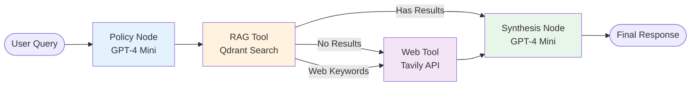

# Inspector RAG Architecture - Actual Implementation

## Overview
The Inspector RAG system is a streamlined 4-node LangGraph workflow that provides access to NC building codes and standards with optional web augmentation.

## Architecture Diagram (Actual)



## Core Components

### 1. Policy Node
- **Purpose**: Decides initial query strategy
- **Model**: GPT-4o-mini
- **Output**: 
  ```json
  {
    "action": "rag",
    "query": "formatted query"
  }
  ```
- **Note**: Currently always returns "rag" as first action

### 2. RAG Tool Node
- **Purpose**: Search Qdrant vector database
- **Collection**: `inspector-standards-postmidterm`
- **Embedding Model**: `text-embedding-3-small`
- **Process**:
  1. Embed query with OpenAI
  2. Vector similarity search in Qdrant
  3. Return top 6 results
  4. No reranking (uses raw similarity scores)

### 3. Web Tool Node (Conditional)
- **Purpose**: Augment with current web information
- **Provider**: Tavily API
- **Triggers**:
  - No RAG results found
  - Query contains keywords: `["recall", "manufacturer", "cpsc", "best practices", "how to", "current", "update", "2024"]`
- **Limit**: 5 results max

### 4. Synthesis Node
- **Purpose**: Generate final answer
- **Model**: GPT-4o-mini
- **Context Structure**:
  ```
  REGULATORY SOURCES:
  [Up to 6 Qdrant results]
  
  WEB RESOURCES:
  [Up to 5 Tavily results]
  ```
- **Temperature**: 0.1 (deterministic)

## Data Flow

### Sequential Processing
```
1. User Query → "What are GFCI requirements for bathrooms?"
2. Policy Node → {"action": "rag", "query": "GFCI requirements bathrooms"}
3. RAG Tool → Searches Qdrant → Finds 6 documents
4. Conditional Check:
   - If results found AND no web keywords → Skip to Synthesis
   - If no results OR web keywords → Web Tool
5. Web Tool (if triggered) → Searches Tavily
6. Synthesis → Combines all sources → Final answer
```

## Configuration

### Environment Variables
```bash
# Core
OPENAI_API_KEY=<key>
QDRANT_URL=<url>
QDRANT_API_KEY=<key>

# Models
EMBEDDING_MODEL=text-embedding-3-small
CHAT_MODEL=gpt-4o-mini

# Web Augmentation
USE_WEB_AUGMENT=1
WEB_AUGMENT_KEYWORDS=recall,manufacturer,cpsc,best practices,how to,current,update,2024
WEB_TOOL_FETCH_LIMIT=8
WEB_AUGMENT_MAX=5
WEB_MIN_SCORE_GENERIC=0.4
```

## Knowledge Sources

### Qdrant Collection
- **Name**: `inspector-standards-postmidterm`
- **Content**: 
  - NC Building Codes 2024
  - InterNACHI Standards of Practice
  - NCHILB Regulations
- **Size**: ~50,000 chunks
- **Search Method**: Cosine similarity (no reranking)

### Web Sources (Tavily)
- **Use Cases**:
  - Product recalls
  - Manufacturer bulletins
  - Recent updates
  - Best practices
- **Score Thresholds**:
  - Generic: 0.4
  - Recall-related: 0.3

## Actual Code Flow

```python
def create_inspector_rag_graph():
    workflow = StateGraph(InspectorRAGState)
    
    # Add nodes
    workflow.add_node("policy", policy_node)
    workflow.add_node("rag_tool", rag_tool_node)
    workflow.add_node("web_tool", web_tool_node)
    workflow.add_node("synthesis", synthesis_node)
    
    # Linear flow with conditional branch
    workflow.add_edge(START, "policy")
    workflow.add_edge("policy", "rag_tool")
    
    # Conditional after RAG
    workflow.add_conditional_edges("rag_tool", after_rag, {
        "synthesis": "synthesis",
        "web_tool": "web_tool",
    })
    
    workflow.add_edge("web_tool", "synthesis")
    workflow.add_edge("synthesis", END)
```

## Performance Characteristics

### Response Times
- **RAG only**: ~2-3 seconds
- **RAG + Web**: ~4-5 seconds
- **Bottlenecks**: 
  - OpenAI embedding: ~0.5s
  - Qdrant search: ~0.3s
  - Synthesis LLM: ~1-2s

### Limitations
- **No query expansion**: Single query used as-is
- **No reranking**: Raw vector similarity scores
- **No caching**: Every query hits all services
- **Limited context**: 6 RAG + 5 web results max

## Error Handling

### Fallback Chain
1. **Primary**: LangChain ChatOpenAI
2. **Secondary**: Direct OpenAI client
3. **Final**: Return error message

### Common Issues
- **Empty RAG results**: Automatically triggers web search
- **API timeouts**: 30-second timeout on all services
- **Rate limits**: Max 2 retries on OpenAI

## Key Differences from v1 Documentation

| Feature | v1 Documentation | Actual Implementation |
|---------|-----------------|----------------------|
| Architecture | Complex multi-agent | Simple 4-node linear |
| Query Processing | Multi-query generation | Single query |
| Reranking | Cohere reranking | None |
| Caching | LRU + embedding cache | None |
| Routing | Intelligent classification | Simple conditional |
| Models | GPT-4-turbo | GPT-4o-mini |
| Supervisor | Complex orchestration | Simple policy node |

## Integration with Report Writer

### When Called
```python
if needs_rag or iteration > 0:
    rag_context = search_building_codes(clips)
```

### Response Format
```python
{
    "response": "Answer text...",
    "sources": [
        {"source": "NC Code", "content": "..."},
        {"source": "Web", "url": "..."}
    ],
    "success": true
}
```

## Strengths
- **Simple and reliable**: Linear flow minimizes failure points
- **Fast**: 2-3 second typical response
- **Comprehensive**: Combines regulatory + web sources

## Weaknesses
- **No query optimization**: Searches exactly what's asked
- **No relevance reranking**: May miss best results
- **Limited context window**: Only 6+5 documents
- **No learning**: Doesn't improve over time

## Future Improvements (Not Implemented)
- Query expansion for better recall
- Cohere reranking for precision
- Result caching for common queries
- Streaming responses
- Multi-turn conversation support