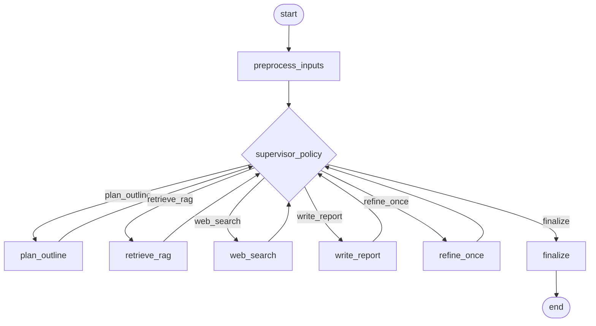

### Report Writer – Option A: Supervisor (Session 6 style)

Purpose: true agentic supervisor routes between tools; capped iteration for speed.

Nodes
- supervisor_policy: decide next step (plan_outline | retrieve_rag | web_search | write_report | refine_once | finalize)
- preprocess_inputs: normalize transcript, extract observations; merge `photo_captions`
- plan_outline: generate section list tailored to transcript/scope
- retrieve_rag (optional): query standards/code snippets (Qdrant)
- web_search (optional): Tavily search when keywords suggest “recalls/updates/manuals”
- write_report: synthesize structured markdown from outline + observations + retrieved snippets
- refine_once (optional): single pass to fill gaps/clarify
- finalize: return markdown + sections + trace-based sources + timings

Mermaid

Default behavior (Demo Day)
- USE_REPORT_RAG=0, USE_REPORT_WEB_AUGMENT=0 (off by default)
- Temperature 0.2; max one refine step; hard cap on total steps (e.g., 5)

Pros
- True agentic control; can adapt per transcript
- Easy to enable RAG/web later without changing shape

Cons
- Slightly higher complexity than single-pass
- Small latency overhead from supervisor calls

Separation from Inspector RAG
- Lives in its own graph/file (e.g., `langgraph_report_writer.py`), endpoint `/api/generate_report`
- Flags are independent from Inspector RAG

Outputs
- report_markdown, sections[], sources (trace-based), timings_ms{}, model_info{}

When to choose
- You want a supervisor now, but still keep runtime predictable and capped.

