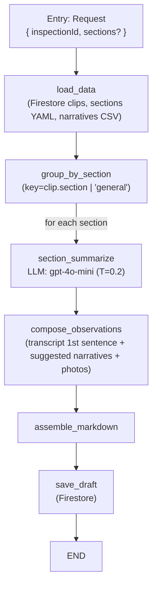

### Option B2 — Session 10 (Open Deep Research) style using LangGraph

Goal: Recast our current report-writer pipeline into a real LangGraph `StateGraph`, following Session 10’s structured, predictable flow. Keep it single-pass per section (fast, demo-friendly), but use nodes/edges for clean orchestration and future upgrade to a light supervisor (Option C).

#### Design summary
- **Framework**: LangGraph (`StateGraph`, `END`)
- **LLMs**: `gpt-4o-mini` for brief section summaries (T=0.2); Whisper already used in the media worker
- **Inputs**: `inspectionId`, optional subset of sections
- **Artifacts**: Markdown draft stored at `inspections/{id}/reports/draft`
- **Data sources**: Firestore (clips/transcripts/photos), Firebase Storage (media blobs), YAML sections, CSV narratives
- **Defaults**: `USE_REPORT_NARRATIVES=1` (keyword match baseline, semantic match later)

#### Node graph (logical)



#### State schema (TypedDict)
```python
from typing import TypedDict, List, Dict, Optional

class ReportState(TypedDict, total=False):
    inspection_id: str
    sections_filter: Optional[List[str]]
    sections_catalog: List[Dict]
    narratives_by_section: Dict[str, List[Dict]]
    clips: List[Dict]              # {id, section, transcript, photos[], status}
    grouped_clips: Dict[str, List[Dict]]
    section_summaries: Dict[str, str]
    markdown: str
    section_count: int
    clip_count: int
    saved: bool
```

#### Nodes (Session 10-style, single pass)
- `load_data(state) -> state`
  - Read clips: Firestore Admin (`inspections/{id}/clips/*`)
  - Load sections: `api/config/report_sections.yaml`
  - Load narratives: `docs/reference/narratives.csv` (enabled via `USE_REPORT_NARRATIVES`)
- `group_by_section(state) -> state`
  - Bucket clips by `clip.section` (fallback `general`); apply `sections_filter` if provided
- `section_summarize(state) -> state`
  - For each section, concatenate transcripts (capped), call `gpt-4o-mini` with a concise summary prompt
- `compose_observations(state) -> state`
  - For each clip, add first sentence of transcript, keyword-matched narratives (max 3), photo links+captions
- `assemble_markdown(state) -> state`
  - Build report header (inspection id, timestamp), then per-section:
    - H2 label, optional bold summary, bullet observations (+ photos)
- `save_draft(state) -> state`
  - Write to Firestore: `inspections/{id}/reports/draft` with `{ markdown, sectionCount, clipCount, usedNarratives }`

#### LLM prompts (concise)
- Section summary (system):
  - “You are drafting a concise homeowner‑friendly section summary for a home inspection report. Tone: objective, non‑alarmist. 1–2 sentences. No speculation.”
- Section summary (user):
  - `Section: {label}\nNotes:\n{context<=4k}`

#### Matching narratives (baseline)
- Keyword overlap between transcript and each narrative’s `Comment Name + Comment Text`
- Score descending; top‑k (default 3) per clip
- Severity tag from `Category (-1, 0, 1)` → Cosmetic / Minor / Major
- Post‑demo: swap for semantic similarity (embedding/LLM) and/or section‑scoped retrieval

#### Files & placement
- New module: `api/langgraph_report_writer.py`
  - Contains `ReportState`, node functions, and `build_report_graph()` returning a compiled graph
- API glue (minimal edits): `api/app.py`
  - In `/api/generate_report`: build state → `graph.invoke(state)` → persist & return
- Docs (this file): `docs/plan/report-writer/Option_B2_S10_LangGraph.md`

#### Config flags
- `USE_REPORT_NARRATIVES=1` (default on)
- `OPENAI_API_KEY` (backend)
- `FIREBASE_SERVICE_ACCOUNT_JSON` (backend)
- Timeouts already set for Whisper/audio; not used in this graph

#### Error handling
- Missing clips → 400 early exit
- Empty section after filter → 400 with message
- LLM failure for summary → continue without summary (log warning)
- Firestore save failure → still return draft in response body (saved=False)

#### Test plan (local)
1) Create inspection, add 2–3 clips with transcripts/photos across 2 sections
2) POST `/api/generate_report` with `{"inspectionId": "..."}`
3) Verify response markdown and Firestore `reports/draft`
4) Optional: POST with `{"inspectionId": "...", "sections": ["roof", "electrical"]}`

#### Future: upgrade path to Option C (supervisor)
- Wrap this B2 graph in a light supervisor: apply guards (min clips per section), retries on summary, optional grader
- Keep node contracts unchanged; supervisor only orchestrates policies/loops


