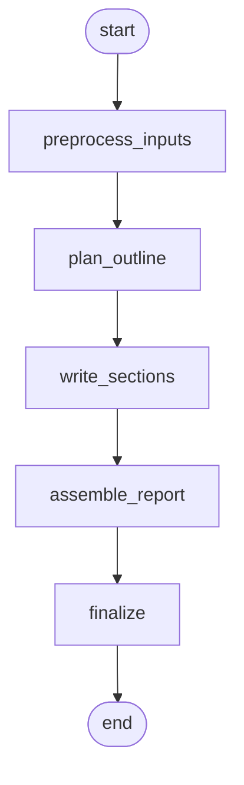

### Report Writer – Option B: Structured Writer (Session 10 style)

Purpose: outline → write single-pass for speed and coherence.

Nodes
- preprocess_inputs: normalize transcript, extract observations; merge `photo_captions`
- plan_outline: deterministic report sections based on scope (Roof, HVAC, etc.)
- write_sections: fill each section from observations (no external calls)
- assemble_report: join sections, add Executive Summary, Limitations
- finalize: return artifacts

Mermaid

Default behavior (Demo Day)
- No supervisor, no loops; temp 0.2
- RAG/web flags exist but default OFF; can be added later as pre-write augmentation

Pros
- Fastest, simplest; highly predictable output shape
- Very readable code and easy to maintain

Cons
- No agentic routing; can’t adapt mid-run
- Weaker grounding unless RAG/web is added later

Separation from Inspector RAG
- Separate graph/file and endpoint; no shared flags

Outputs
- report_markdown, sections[], sources (Transcript/Photo captions only), timings_ms{}

When to choose
- You want to ship a clean MVP today with minimal moving parts.

