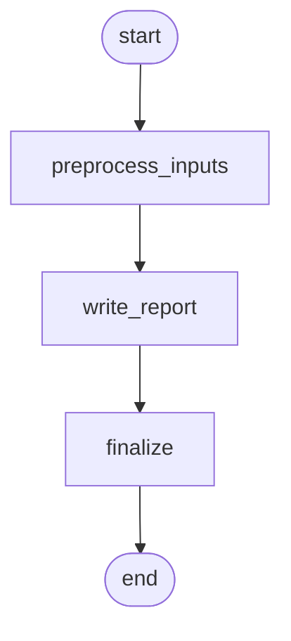

### Report Writer – Option D: Ultra Simple MVP

Purpose: fastest path—single call writer after light preprocessing.

Nodes
- preprocess_inputs: normalize transcript, extract observations; merge `photo_captions`
- write_report: prompt writes all sections in one shot (fixed template)
- finalize

Mermaid

Default behavior (Demo Day)
- No supervisor, no retrieval; temp 0.2

Pros
- Smallest implementation; very low latency

Cons
- Least control; output quality depends entirely on a single prompt
- Harder to extend with retrieval without refactor

Separation
- Separate file/endpoint; does not touch Inspector RAG

Outputs
- report_markdown, sections[], sources (Transcript/Photo captions), timings_ms{}

When to choose
- Need something running immediately and will iterate later.

