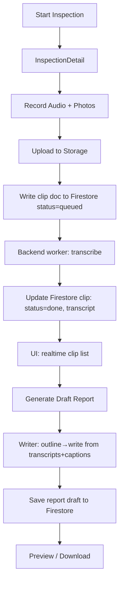

### Demo-Day Plan: Start Inspection → Capture → Report (MVP)

This plan captures the current state and a minimal path to a polished demo. It assumes a 1-week runway and prioritizes reliability over breadth.

What’s implemented
- Backend (FastAPI)
  - POST `/api/inspections` creates an inspection (in-memory id)
  - POST `/api/inspections/{id}/clips` enqueues auto-transcription (background worker)
  - Auto-transcribe worker downloads `audio_url` and generates transcript (currently updates in-memory only)
- Frontend (PWA)
  - `StartInspection` screen → creates inspection; now also persists `inspections/{id}` to Firestore
  - `InspectionDetail` screen → record audio (MediaRecorder), attach photos, upload to Firebase Storage
  - Firestore: clips are written to `inspections/{id}/clips/{clipId}` with status=queued + photos
  - Realtime UI: `InspectionDetail` subscribes to Firestore clips (no more polling)
  - Usability: shows recording duration/size/mime; replay/delete pre-upload

Gaps to close (MVP)
- Transcription persistence: worker must write back to Firestore → `status: processing|done|error`, `transcript`
- Report writer (Option C hybrid, partial allowed): backend endpoint `/api/generate_report`
  - Input: `inspectionId` (and optional `include_sections` for partial)
  - Collects transcripts + photo captions from Firestore
  - Outline→write (deterministic), temp≈0.2, no RAG/Web by default
  - Output: markdown + sections + timings; save draft to `inspections/{id}/reports/{draftId}`
- UI: one-click "Generate Draft" on `InspectionDetail` (partial for demo)
- Dev hygiene: SW bypass during dev; Storage rules (auth required); App Check unenforced in dev

Phased plan (with clear cut lines)
- Phase 1 (Today)
  - Backend: write transcription results to Firestore `inspections/{id}/clips/{clipId}`
  - Frontend: show clip `status` badge from Firestore; show `transcript` when done
  - Robust uploads: contentType set for audio/photos; improved errors
  - Delete clip (frontend + Firestore doc deletion; Storage delete optional for demo)

- Phase 2 (Tomorrow)
  - Implement `/api/generate_report` (Option C hybrid; partial allowed)
    - Outline: Executive Summary; Findings by System (limited set for demo); Limitations
    - Source of truth: Firestore clips (transcripts + photo captions)
    - No RAG/Web; narratives OFF by default; return markdown
  - Persist draft to Firestore: `inspections/{id}/reports/{draftId}` with `report_markdown` and metadata
  - Frontend: "Generate Draft" button on `InspectionDetail` → download `.md` and show preview

- Phase 3 (Polish)
  - Add system tags to clips (select chip when saving); group findings in report by tag
  - Optional: enable Narratives (licensed CSV) behind `USE_REPORT_NARRATIVES=1`
  - Optional: partial demo mode `include_sections` for a 3-section flow

Mermaid: end-to-end MVP flow


MVP acceptance checklist
- [ ] New inspection persists to Firestore
- [ ] Clip created → Firestore status transitions queued→processing→done (transcript present)
- [ ] UI shows realtime updates without refresh
- [ ] Generate Draft produces a markdown file and saves a Firestore draft
- [ ] Demo path with 2–3 clips (Roof/Exterior/Electrical) yields a coherent draft

Non-goals for demo week
- Full checklist coverage and severity taxonomy (can stage as placeholders)
- App Check enforcement; strict authz beyond owner-bound checks
- Narratives/RAG/Web by default (keep OFF; toggle only if time allows)

Risks & mitigations
- Upload flakiness (SW/CORS): bypass SW in dev; confirm Storage rules; keep App Check off
- Backend restarts: Firestore holds state; UI subscribes instead of polling
- Latency: keep clips short; no web augment; temperature low

Owner-bound Firestore rules (post-demo tightening)
```text
service cloud.firestore {
  match /databases/{database}/documents {
    match /inspections/{inspectionId} {
      allow read, write: if request.auth != null && request.auth.uid == resource.data.ownerUid;
      match /clips/{clipId} { allow read, write: if request.auth != null && request.auth.uid == resource.data.ownerUid; }
      match /reports/{draftId} { allow read, write: if request.auth != null && request.auth.uid == resource.data.ownerUid; }
    }
  }
}
```

Summary: Ship a narrow, reliable flow
- Persist inspection/clip state to Firestore; show realtime in UI
- Auto-transcribe updates Firestore
- Generate a clean, partial report from transcripts + captions; save draft
- Keep extras (Narratives/RAG/Web) optional to protect the timeline


