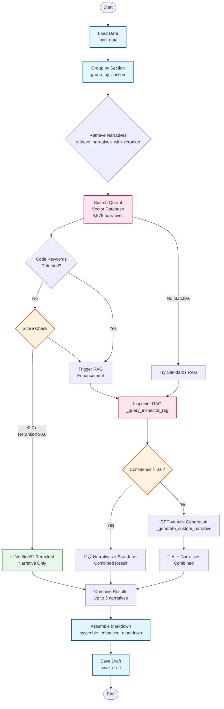

# Report Generation Flow - LangGraph Architecture

## Overview
The report generation system uses LangGraph to orchestrate a multi-node workflow that processes inspection data through various enrichment stages.

## Visual Flow Diagram



## Node Descriptions

### 1. **Load Data** (`load_data`)
- **Input**: `inspection_id`, `sections_filter`
- **Loads**:
  - `clips` from Firestore `inspections/{inspection_id}/clips`
    - Fields: `id`, `section`, `transcript`, `photos`, `status`
  - `inspection_meta` from Firestore `inspections/{inspection_id}`
  - `sections_catalog` from `api/config/report_sections.yaml` (fields: `key`, `label`, `includes`)
- **Initializes (empty)**: `narratives_by_section`, `narrative_sources`, `section_severity`, `quality_scores`, `rag_results`
- **Output**: `clips`, `inspection_meta`, `sections_catalog`

### 2. **Group by Section** (`group_by_section`)
- **Input**: `clips`
- **Process**: Groups clips by their section (e.g., electrical, plumbing)
- **Output**: `grouped` (Dict[section_key, List[clips]])

### 3. **Retrieve Narratives** (`retrieve_narratives_with_reranker`)
The core intelligence node with cascading fallbacks:

#### 3a. **Qdrant Search**
- Searches 6,576 pre-written expert narratives
- Uses OpenAI embeddings (text-embedding-3-small)
- Filters by section for relevance

#### 3b. **Score Evaluation & Standards Compliance Check**
**First, check for standards-related keywords**: 'code', 'violation', 'standard', 'requirement', 'compliance', 'safety'

**Decision Logic:**
- **High confidence AND no standards keywords**:
  - Reranked with score ≥ 0.6 → 🎯 Reranked Narratives
  - Non-reranked with score ≥ 0.7 → ✅ Verified Narratives
  
- **Low confidence OR standards keywords mentioned**:
  - Trigger Standards RAG enhancement
  - **Result**: 📋 Standards-Based or 🎯📋 Narratives+Standards
  - Combines expert narratives with building standards

#### 3c. **Inspector RAG** (Enhancement/Fallback)
- Triggered when:
  - Low confidence narratives (< thresholds)
  - Code compliance keywords detected
  - No narratives found at all
- Searches ≈16.6k chunks of NC Building Codes & SOPs
- Uses `inspector-standards-postmidterm` collection
- If confidence > 0.6: Adds code-compliant narrative to existing ones

#### 3d. **GPT-4o-mini Generation** (Last Resort)
- Only when RAG confidence ≤ 0.6 or RAG fails
- Generates custom narrative
- Still combined with database narratives if available
- Result: 🤖 AI Generated + database narratives

### 4. **Assemble Markdown** (`assemble_enhanced_markdown`)
- Combines all narratives into professional report format
- Includes executive summary, quality metrics
- Generates severity badges and source attribution

### 5. **Save Draft** (`save_draft`)
- Persists to Firestore (`reports/draft`)
- Returns final markdown and metadata

## Decision Flow Summary

### When Each Source is Used:
1. **✅/🎯 Narratives Only**: 
   - High confidence (≥0.7 or reranked ≥0.6) 
   - AND no code compliance keywords

2. **🎯📋 Narratives + Standards (Hybrid)**:
   - Narratives exist AND:
     - Low confidence (<thresholds) OR
     - Code keywords detected ('code', 'violation', 'standard', 'safety', etc.)
   - RAG confidence > 0.6
   - Combines both expert narratives and building standards

3. **📋 Standards-Based Only**:
   - NO narratives found in database
   - RAG confidence > 0.6
   - Uses building codes & regulations

4. **🤖 AI Generated**:
   - RAG confidence ≤ 0.6 or RAG admits no relevant info
   - Still combines with narratives if available

### Important Notes:
- **Code keywords trigger RAG**: Even high-quality narratives get RAG enhancement if code compliance mentioned
- **Narratives are preserved**: Database narratives are combined with RAG/AI, not replaced
- **Smart confidence detection**: RAG responses saying "couldn't find relevant" get low confidence
 - **Version tags**: API responses may show `2.1_reranker` while Firestore draft metadata stores `2.0_enhanced`; both denote the reranker pipeline.

## State Management

The system uses `ReportState` (TypedDict) to maintain state across nodes:

```python
class ReportState(TypedDict, total=False):
    inspection_id: str
    sections_filter: Optional[List[str]]
    # Loaded data
    clips: List[Dict]
    inspection_meta: Dict
    sections_catalog: List[Dict]
    narratives_by_section: Dict[str, List[Dict]]
    # Enhanced tracking
    narrative_sources: Dict[str, str]
    section_severity: Dict[str, str]
    quality_scores: Dict[str, float]
    rag_results: Dict[str, Dict]
    # Grouped
    grouped: Dict[str, List[Dict]]
    # Output
    markdown: str
    section_count: int
    clip_count: int
    saved: bool
    section_metadata: Dict[str, Dict]
    executive_summary: str
    report_quality_score: float
```

## Key Technologies

- **LangGraph**: Orchestration framework for multi-node workflows
- **Qdrant**: Vector database for narrative storage (1536-dim embeddings)
- **Cohere**: Reranking API for improved semantic matching
- **OpenAI**: Embeddings (text-embedding-3-small) and generation (gpt-4o-mini)
- **Firestore**: Persistence layer for inspection data and reports

## Configuration

Environment variables control behavior:
- `USE_ENHANCED_REPORT`: Not used (API always uses enhanced reranker graph)
- `COHERE_API_KEY`: Enable reranking (auto-detected)
- `REPORT_LOGS=1`: Enable debug logging to see cascade
- `QDRANT_COLLECTION`: Default `narratives_v1`
- `EMBEDDING_MODEL_NAME`: Default `text-embedding-3-small`

Endpoint behavior:
- `/api/generate_report` uses the reranker graph by default; reranking activates when `COHERE_API_KEY` is set.

## Performance Characteristics

- **Narrative Retrieval**: ~200-500ms per section
- **Cohere Reranking**: +100-200ms when enabled
- **Inspector RAG**: ~2-5s when triggered
- **GPT-4o-mini Generation**: ~3-5s when needed
- **Total Report Generation**: 10-30s depending on sections and fallbacks

## Quality Assurance

The system tracks quality at multiple levels:
- **Per-section quality scores**: Based on narrative source and confidence
- **Overall report quality**: Weighted average with bonus for verified narratives
- **Source attribution**: Every narrative tagged with its origin
- **Severity tracking**: Critical, Major, Minor, Info badges

## Example Output Structure

```markdown
# 🏠 Professional Home Inspection Report

## 📊 Report Quality Metrics
- Overall Quality Score: 85%
- Verified Narratives: 7/10

## 📋 Executive Summary
[AI-generated summary of key findings]

## Electrical
🔴 **Critical** • ✅ **Verified Narrative** (92% match)

### Findings & Recommendations
1. Double-tapped breaker observed...
2. 📋 Per NEC 408.41, each circuit breaker shall... (Building Code-Enhanced)
3. Consider panel upgrade for safety...

### Inspection Notes
- Two wires connected to single breaker
```

This architecture ensures every section receives appropriate narratives through intelligent cascading with transparent sourcing.