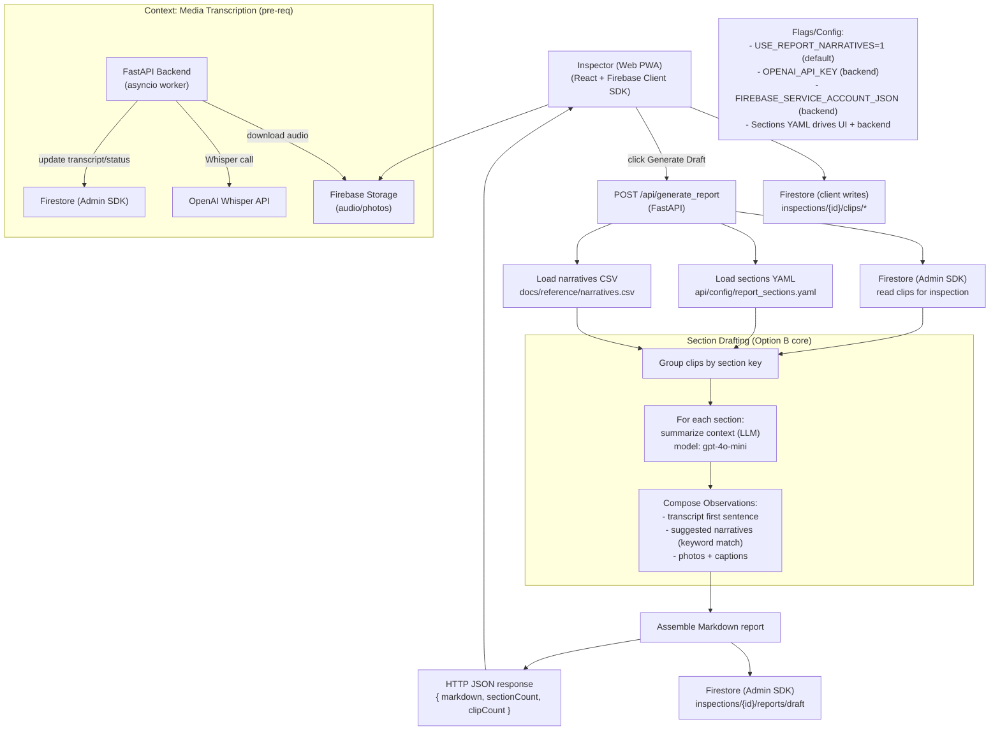
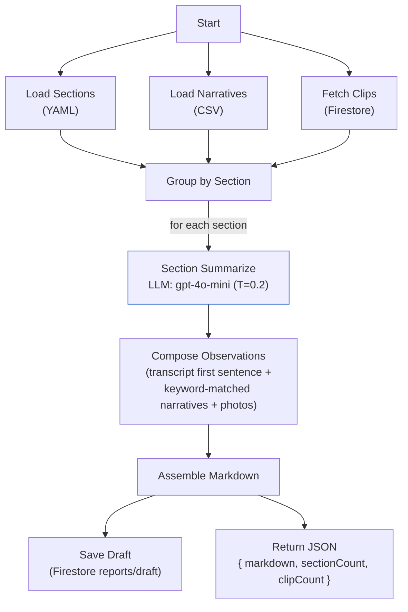

### Report Writing v1 – Architecture (Option B core with narratives on)

**What this covers**
- **Generate Draft** endpoint that compiles sectioned Markdown from transcripts and photos.
- Narratives (docs/reference/narratives.csv) ON by default; keyword‑matched per section.
- Stores draft to Firestore and returns it to the client.

**Tech stack**
- **Backend**: FastAPI (Python), Firebase Admin SDK, OpenAI API (gpt‑4o‑mini + Whisper), httpx, asyncio
- **Frontend**: React PWA, Firebase Web SDK (Auth, Firestore, Storage)
- **Data**: Firestore (inspections, clips, reports), Firebase Storage (audio/photos), YAML sections, CSV narratives

**Primary endpoint**
- `POST /api/generate_report` → reads `inspections/{id}/clips/*` from Firestore, loads `api/config/report_sections.yaml` and `docs/reference/narratives.csv`, summarizes each section, composes observations (transcript first sentence + suggested narratives + photos), assembles Markdown, stores to `inspections/{id}/reports/draft` and returns `{ markdown, sectionCount, clipCount }`.

**Flags / config**
- `USE_REPORT_NARRATIVES=1` (default)
- `OPENAI_API_KEY` (backend)
- `FIREBASE_SERVICE_ACCOUNT_JSON` (backend)
- `api/config/report_sections.yaml` drives the canonical sections for both UI and backend

**Flow summary**
- Inspector records audio and attaches photos in the PWA → uploads to Storage; clip doc written to Firestore.
- Backend worker downloads audio, calls Whisper, writes transcript + status to Firestore.
- User clicks Generate Draft → backend groups clips by section → optional section summary via GPT‑4o‑mini → observations include transcript evidence, suggested narratives, and photo captions → Markdown assembled and stored.

**Diagram**

**Notes**
- The supervisor layer (Option C) can wrap this flow later without changing data contracts.
- Suggested narratives are heuristic keyword matches; we can swap in semantic matching post‑demo.

### LangGraph nodes (logical) and LLMs

Although v1 is implemented inline in a FastAPI endpoint (not a literal LangGraph graph yet), the pipeline maps cleanly to the following nodes. This makes it easy to wrap with a thin supervisor later (Option C) without changing data contracts.

Planned supervisor (Option C): add a `Supervisor` node to orchestrate per-section steps (apply guards, retries, optional grading) while keeping `SS/CO/AM/SD` node contracts the same.

